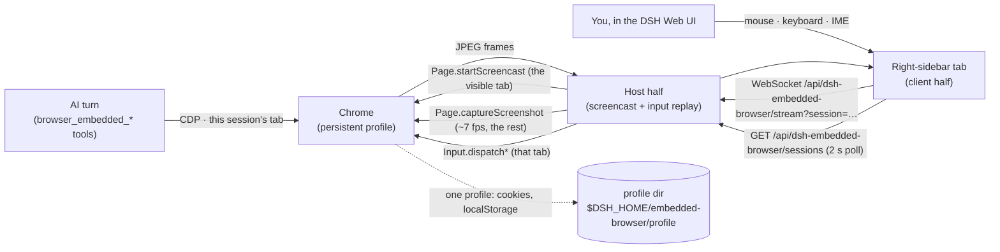

# dsh-embedded-browser

**English** | [简体中文](README.zh.md)

A browser that lives inside the DSH host: every DSH session gets **its own tab** in it, the AI drives that tab with `browser_embedded_*` tools, and you watch — or take over — the very same tab in a **right-sidebar tab that opens on demand** in the DSH Web UI.

> **Renamed in 0.3.0.** Up to 0.2.0 this plugin was `dsh-browser-panel`: its tools were `browser_panel_*`, its routes lived under `/api/dsh-browser-panel/*`, and its profile under `$DSH_HOME/browser-panel/profile`. The package, the repository and every one of those names changed together, so the tool prefix now matches the package name. Point `profileDir` at the old directory if you want to keep the logins of an 0.2.0 install.

It exists for one stubborn problem: agents run on machines with no display, but the sites they need are behind a login. A headless browser can be scripted; it cannot scan a QR code, type an SMS code, or solve a CAPTCHA. With this plugin the human does that part **inside the DSH Web UI**, on the same tab the AI is already working on, and the result stays in a persistent profile — so a login performed once works in every session, now and after a restart.

## The problem

- An agent host (container, VM, CI box) has no GUI, so it cannot show you a login page.
- Fully headless automation breaks at the first step that needs a person: SSO redirects, one-time passcodes, QR-code logins, CAPTCHAs, hardware keys.
- Copying cookies or `storageState` into the container is fragile: device-bound credentials, fingerprints, and WebAuthn simply do not transfer.

## What it does

**One browser, one tab per session, two control planes.** The AI speaks CDP on its own tab; the human sees and drives that same tab from the sidebar tab that mirrors it. The login the human performs is exactly the session the AI keeps using — and because all sessions share one profile, every other session is logged in too.

### Tools (published lazily)

The twelve `browser_embedded_*` tools are **not registered when the plugin loads.** Their schemas are billed on every request, so by default they stay off the tool list until something proves the model is doing browser work:

- a successful `skill` call naming `browser-use`;
- the `/browser-use` gesture typed by a human;
- a past successful invocation found in a session log — this third path is what reopens the gate after a plugin reload.

So: **no skill, no tools.** Install the `browser-use` skill alongside this plugin (see [Install](#install)) — it is the routing skill that also covers the BrowserSkill channel, and calling it is what publishes these twelve. Once open, the gate stays open for the rest of the host process and for **every** session — including sessions created later — because `ctx.tools.register` writes into one host-wide registry. A session that never read the skill seeing the tools is therefore normal, not a plugin that failed to mount. Restarting `dsh-web` starts a fresh process — and a closed gate: the tools are gone again until some session invokes the skill, because the reload replay only sees sessions that are live at that moment (see `references/PITFALLS.md` #24). Set `lazyTools: false` to register the suite at load instead.

| Capability | Tool | Notes |
|---|---|---|
| Report state | `browser_embedded_status` | Running? Which URL/title has *this session's* tab? Is a human action pending? |
| Open a URL | `browser_embedded_navigate` | Starts the browser on first use; `newTab` replaces this session's page with a fresh tab |
| Read the page | `browser_embedded_snapshot` | Title, URL, numbered inventory of clickable/typable elements, visible text |
| Click | `browser_embedded_click` | By element number or by visible text; real input events |
| Fill a field | `browser_embedded_type` | React/Vue-friendly insertion; `submit` presses Enter |
| Press a key | `browser_embedded_press` | Enter, Tab, Escape, arrows, PageUp/Down, … |
| Scroll | `browser_embedded_scroll` | down/up/left/right/top/bottom |
| **Change the environment** | `browser_embedded_emulate` | Device preset (7 of them, `iphone-14` …), explicit viewport (`width`+`height`), or light/dark (`theme`); `reset: true` restores the default |
| **Evaluate in the page** | `browser_embedded_eval` | Runs JavaScript in this session's page and returns a bounded JSON projection (switch a theme attribute, read computed styles, assert on state) |
| Look at the page | `browser_embedded_screenshot` | PNG returned to the model as an image attachment |
| **Ask the human** | `browser_embedded_ask_human` | Brings up *this session's* browser tab with your instruction and **waits** until they press 我已完成 |
| Close the tab | `browser_embedded_close` | Closes this session's tab; the profile (and every login) stays |

`browser_embedded_emulate` is **per tab** and temporary: it changes no configuration, needs no restart, and cannot touch another session. `reset: true` returns the tab to the `viewport` the config pins. The preset names, dimensions, DPR and user agents are mirrored field for field from the BrowserSkill channel's `bsk emulate --device`, so "the same device" means the same page on either channel. Checking what a page looks like on a phone, and in the dark, is these two calls:

```
browser_embedded_emulate  { "device": "iphone-14" }   →  browser_embedded_screenshot
browser_embedded_emulate  { "theme": "dark" }         →  browser_embedded_screenshot
browser_embedded_emulate  { "reset": true }
```

One difference worth knowing: `device` is **device fidelity, not "a narrow window"**. A page that declares no `<meta name="viewport" content="width=device-width, initial-scale=1">` gets the default mobile viewport of **980 CSS pixels** and is zoomed out — exactly as a real phone would render it. To pin a layout width instead, pass `width`/`height` without `mobile`, which always takes effect.

Sidebar side (DSH Web UI):

- a **浏览器 / Browser** tab in the right sidebar holds the live view of *that* session's tab. It is **not** pinned to every session: it opens itself the moment the session gets a browser tab, so a conversation that never touches a browser shows no extra surface at all;
- the right sidebar's **guide page** carries an 内嵌浏览器 / Embedded browser entry, which is how you open the tab by hand (before the AI has started a browser, or after you closed it);
- the tab chip carries a small dot while the session it belongs to is waiting for a person — the only cross-session signal now that the host-wide overview is gone;
- the canvas accepts your mouse, wheel, keyboard and IME input — it is not a screenshot viewer, the events are replayed into the very CDP session the AI uses;
- the hand-over banner appears in the tab of **the session that asked**, with a 我已完成 / Done button that resumes the waiting tool call (and an optional note back to the AI);
- a toolbar with back / forward / reload / repaint, Tab / ⇧Tab / Enter to walk a form without aiming the mouse, and 结束并清理 / Close tab;
- closing the tab is obeyed: it does not come back by itself until the browser itself comes back — except for a *new* hand-over request, which would otherwise hang until it timed out.

## How it works



- The host half launches one Chrome per DSH host process. With `mode: auto` it runs **headed on a private Xvfb** when Xvfb is available (better fingerprint than headless) and falls back to `--headless=new` otherwise.
- A session's tab is created **lazily** — on that session's first `browser_embedded_*` call, or when the human presses the open button in that session's sidebar tab — and closed when the session is disposed, when the AI calls `browser_embedded_close`, or when the human presses 结束并清理 / Close tab. Sessions are isolated in *page state*, not in identity: they share the profile, so a login performed once is available everywhere.
- Every tab is **activated once** when it is created. A Chrome target that was never activated silently discards every injected input event for the rest of its life, and one activation repairs it permanently. Afterwards a session's tab accepts input even while it is in the background — so the AI never moves your foreground.
- Chrome only emits screencast frames for the **active tab**. The sidebar tab you are actually looking at sends `focus` and owns the real `Page.startScreencast`; every other attached session is served by polled `Page.captureScreenshot` frames (~7 fps target; its first frame can be cold — seconds — while another tab owns the screencast). A freshly opened panel always gets a seeded frame, because a static page emits none on its own.
- The tab body is **mounted while its tab is invisible** too (a collapsed column, an inactive tab), so the component gates on visibility rather than on mount: a hidden tab holds no WebSocket and asks for no `focus`, and therefore never steals the browser's foreground from whoever is watching.
- Tools carry no session parameter: every handler reads the session id from its own execution context (`exec.agent.id`), so tool names and parameters stay small and a session can never steer another session's tab. A call with no owning session is an error.
- The tools are published by the routing skill rather than by plugin load (see above); the plugin's own system-prompt section points the model at that skill, which is what keeps a gated suite discoverable.
- The panel is served by the host webserver, on the same origin and behind **the same session authentication as the Web UI itself** (`connection.requestRejection`). The routes that belong to a session carry its id — `GET /api/dsh-embedded-browser/state?session=…`, `POST /open|/close` (session in the body), and the `/stream?session=…` WebSocket upgrade — while `GET /sessions` and `GET /health` describe the whole host, and `POST /human-done` settles a request by id. No extra port, no extra token, no tunnel.
- Human take-over is per session: two sessions can wait on a human at the same time, and a request is delivered only to the sidebar tab of its own session.
- Frames travel as JPEG over one WebSocket; input travels back as small JSON messages. Frames are dropped rather than queued when your connection falls behind.
- Nothing is written into DSH core: the plugin is one composition row.
- The measured constraints behind these choices are written down in [`references/PITFALLS.md`](references/PITFALLS.md) (#11–#13 for the browser, #14–#16 for the sidebar and the lazy gate).

## Requirements

- DSH `>= 0.1.5-rc.2`, Node `>= 22.19`.
- A Chromium-family browser. Auto-detected in this order: `browserPath` config → `google-chrome-stable` / `google-chrome` / `chromium` / `chromium-browser` / `chrome` on `PATH` → Playwright cache (`~/.cache/ms-playwright/chromium-*/…`) → Puppeteer cache.
- Optional: `Xvfb` on `PATH` for headed mode. Without it the plugin runs headless automatically.

## Install

Version **0.3.0**. This release renames the package, so it breaks every name an 0.2.0 install used: `dsh-browser-panel` → `dsh-embedded-browser`, `browser_panel_*` → `browser_embedded_*`, `/api/dsh-browser-panel/*` → `/api/dsh-embedded-browser/*`, `$DSH_HOME/browser-panel/profile` → `$DSH_HOME/embedded-browser/profile`. 0.2.0 is the last release under the old name; 0.2.0's own break (per-session tabs, no shared-page mode) still stands.

```sh
# npm
dsh plugin --profile web add dsh-embedded-browser

# straight from GitHub
dsh plugin --profile web add github:imroc/dsh-embedded-browser
```

A plugin has to end up in the profile **twice**: as a dependency (so its code is in the profile's own `node_modules`) and in `dsh.profile.bundles` (so the patch that inserts the plugin row is actually applied). `dsh plugin … add` does both, because the package declares `dsh.bundle`; a dependency added by hand alone mounts nothing.

The package ships its built JavaScript, so nothing is compiled on install.

Restart the Web UI afterwards (adding a plugin row is a boot-time composition change):

```sh
systemctl --user restart dsh-web      # or however you run `dsh web`
```

### Recommended: the `browser-use` skill

The twelve tools are gated behind the `browser-use` skill, and that skill does **not** ship inside this package — it belongs to the skills your profile loads. Without it (or a `/browser-use` gesture) the gate never opens and no `browser_embedded_*` tool is ever published; the model will simply report that those tools do not exist:

- install a global **`browser-use`** skill, or
- set `lazyTools: false` to register the suite at load, and pay its schemas on every request.

The skill name is compiled into `lib/lazy.js` (`SKILL_NAME`). If you rename the skill on your side, rename it there too.

## Verify

1. The tools are gated, so open the gate first: ask the AI to use the `browser-use` skill, or type `/browser-use` in the conversation. The twelve `browser_embedded_*` tools are now published for **every** session in this host process, including sessions created later.
2. Ask for a page:

   ```
   Use browser_embedded_navigate to open https://example.com, then browser_embedded_snapshot.
   ```

3. The first browser call opens a **浏览器 / Browser** tab in the right sidebar by itself — that is this session's own tab in the host Chrome. Before there is any browser there is no tab; the sidebar's guide page (内嵌浏览器 / Embedded browser) is the manual way to open one first.
4. Ask the AI to hand over, then complete the login yourself in that tab:

   ```
   Call browser_embedded_ask_human with the instruction "请在面板里完成登录，然后点我已完成".
   ```

5. Log in, press **我已完成** — the tool call returns, and the AI continues with an authenticated session. Close the tab first if you like: the next hand-over request brings it back.
6. In a second session, open its own browser tab: it is a *different* tab, but it is already logged in, because the profile is shared. Close one session's tab (`browser_embedded_close`, or 结束并清理 / Close tab) and reopen it: still logged in.

## Configuration

Override any field from your own patch layer (`~/.dsh/cordis.patch.yml`, or the profile's `cordis.patch.yml`). The whole `config` key is replaced, so restate what you need:

```yaml
- id: embedded-browser
  config:
    mode: headless            # auto | headed | headless
    viewport: 1280x800
    idleShutdownMinutes: 30
```

| Key | Default | Meaning |
|---|---|---|
| `browserPath` | `''` | Explicit Chrome/Chromium path; empty = auto-detect. |
| `profileDir` | `''` | Persistent profile; empty = `$DSH_HOME/embedded-browser/profile`. Shared by every session. |
| `mode` | `auto` | `auto` = headed on a private Xvfb when available, else headless. |
| `screen` | `1440x900x24` | Geometry of the private Xvfb. |
| `windowSize` | `1440x900` | Chrome window size in headed mode. |
| `viewport` | `1440x900` | The **default** emulated viewport of every tab — `browser_embedded_emulate` overrides it per tab, and `reset` comes back here. |
| `xvfbDisplay` | `:99` | Preferred X display; the next free one is used if taken. |
| `port` | `0` | Fixed DevTools port; `0` picks a free one. |
| `startUrl` | `about:blank` | First URL of each session's fresh tab. |
| `extraArgs` | `[]` | Extra Chrome switches. |
| `snapshotMaxChars` | `4000` | Page text budget per snapshot. |
| `maxElements` | `80` | Interactive elements listed per snapshot. |
| `screencastQuality` | `60` | JPEG quality of the stream (and of the polled stills). |
| `screencastMaxWidth` | `1440` | Maximum streamed frame width. |
| `pollFrameMs` | `140` | Poll interval for panels that cannot own the foreground screencast (~7 fps). Values below `60` are clamped. |
| `askHumanTimeoutSeconds` | `600` | Default budget of `browser_embedded_ask_human`. |
| `idleShutdownMinutes` | `10` | Stop the browser — and with it every session's tab — after this much idle time; `0` never stops it. Reaping is lossless: a tab reopens at its last URL, and the profile keeps every login. |
| `autoStart` | `false` | Start the browser with the host instead of on first use. |
| `lazyTools` | `true` | Publish the twelve tools only after the `browser-use` skill is invoked (a host-wide gate: one session opens it for all); `false` registers the suite at load. |
| `startTimeoutMs` | `20000` | How long to wait for the DevTools endpoint after launch. |

## Security notes

- The panel and its WebSocket live behind the **same authentication as the DSH Web UI**. Anyone who can see the panel can already drive the host browser — treat Web UI access accordingly.
- Sessions are isolated in page state, **not** in identity: every session uses the same browser profile, and therefore the same cookies and logins. That is the point of the plugin, but it also means one session's AI can reach any site the profile is logged into.
- The browser profile holds real sessions. It stays on the host, under the DSH home, is never uploaded, and is not part of the Git repository.
- Browser traffic goes out from the container. A data-centre IP is a weaker signal than your laptop's; for sites that are aggressive about automation, `mode: headed` (the default whenever Xvfb is available) is the better half of the trade.
- Prefer running Chrome as a non-root user with the sandbox on; the plugin only adds `--no-sandbox` automatically when the host process runs as root.

## Rollback

```sh
dsh plugin --profile web remove dsh-embedded-browser   # or delete the row from cordis.patch.yml
```

Then restart the Web UI. The profile directory is left in place, so reinstalling keeps your logins. Delete `$DSH_HOME/embedded-browser/profile` to forget them.

## License

MIT
