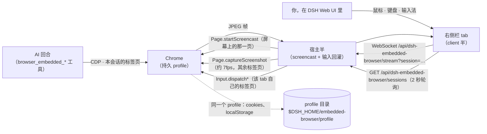

# dsh-embedded-browser

[English](README.md) | **简体中文**

一个住在 DSH 宿主里的浏览器：**每个 DSH 会话都拥有它自己的标签页**，AI 用 `browser_embedded_*` 工具驱动自己那一页，而你在 DSH Web UI **右侧栏里按需弹出的 tab** 中看**同一个标签页**，随时可以接手。

> **0.3.0 起更名。** 0.2.0 及以前这个插件叫 `dsh-browser-panel`：工具是 `browser_panel_*`，路由在 `/api/dsh-browser-panel/*`，profile 在 `$DSH_HOME/browser-panel/profile`。包名、仓库名和这些名字一起改了，现在工具前缀与包名一致。想保留 0.2.0 装出来的登录态，把 `profileDir` 指回旧目录即可。

它为一个顽固的问题而生：agent 跑在**没有显示器**的机器上，而它要用的站点都在登录后面。无头浏览器可以被脚本驱动，但它扫不了二维码、收不了短信验证码、过不了人机校验。有了这个插件，这些环节由**你在 DSH Web UI 里**完成，而且就在 AI 正在操作的那个标签页上；结果落进持久 profile，所以**登录一次，所有会话都能用**，重启之后也还在。

## 要解决的问题

- agent 宿主（容器、虚机、CI 机器）没有 GUI，无法把登录页展示给人看。
- 纯无头自动化会在"需要真人"的第一步卡死：SSO 跳转、一次性验证码、扫码登录、图形验证码、硬件密钥。
- 把 cookie / `storageState` 搬进容器很脆：设备绑定凭据（DBSC）、指纹、WebAuthn 都搬不过去。

## 能力

**一个浏览器、每个会话一个标签页、两个控制面**：AI 在自己那一页上走 CDP，人类在右侧栏那个镜像它的 tab 里看同一页、操作同一页；人类登录出来的会话，正是 AI 继续使用的会话——而且因为所有会话共用一个 profile，其余会话也一并处于登录态。

### 工具（懒注册）

这 10 个 `browser_embedded_*` 工具**不会在插件加载时就注册**。工具 schema 每一轮请求都要计费，所以默认它们不进工具列表，直到有证据表明模型确实在做浏览器任务：

- 成功调用 `skill` 工具且技能名为 `browser-use`；
- 人类在会话里发 `/browser-use` 手势；
- 会话历史日志里存在过一次成功调用——第三条路正是插件重载后重新开闸的依据。

也就是说：**没有那个技能，就没有这批工具。** 装插件的同时请一并装 `browser-use` 技能（见[安装](#安装)）——它是浏览器任务的入口技能（同时覆盖 BrowserSkill 通道），调用它就是发布这 10 个工具的动作。开闸是宿主级的、也是永久的：一旦打开，本宿主进程内**所有会话**都能看到这批工具（`ctx.tools.register` 写进的是同一个宿主级注册表）。把 `lazyTools` 设为 `false` 则回到"加载即注册"。

| 能力 | 工具 | 说明 |
|---|---|---|
| 查状态 | `browser_embedded_status` | 是否在运行、**本会话标签页**的 URL/标题、有没有待人类处理的动作 |
| 打开网址 | `browser_embedded_navigate` | 首次调用即启动浏览器；`newTab` 用新标签页替换本会话当前页面 |
| 读页面 | `browser_embedded_snapshot` | 标题、URL、带编号的可交互元素清单、可见正文 |
| 点击 | `browser_embedded_click` | 按元素编号或可见文字；派发真实输入事件 |
| 填字段 | `browser_embedded_type` | 兼容 React/Vue 受控输入；`submit` 顺带回车 |
| 按键 | `browser_embedded_press` | Enter、Tab、Escape、方向键、PageUp/Down 等 |
| 滚动 | `browser_embedded_scroll` | down/up/left/right/top/bottom |
| 看渲染 | `browser_embedded_screenshot` | PNG 以图片附件形式返回给模型 |
| **请人帮忙** | `browser_embedded_ask_human` | 带你的说明把**本会话**的浏览器标签页调出来，并**等待**人类点「我已完成」 |
| 关标签页 | `browser_embedded_close` | 关闭本会话的标签页；profile（含所有登录态）保留 |

面板侧（DSH Web UI）：

- 右侧栏里有一个 **浏览器 / Browser** tab，就是这个会话那一页的实时画面。它**不是**每个会话都钉着的：只要这个会话有了浏览器标签页，它就自己弹出来——所以从不碰浏览器的会话，界面上不会多出任何东西；
- 右侧栏的**引导页**里有「内嵌浏览器」入口，这是手动打开这个 tab 的方式（AI 还没开浏览器时，或你自己把它关掉之后）；
- tab 的 chip 上有一个小圆点，表示这个会话正在等人——宿主级总览界面已经没有了，这是唯一的跨会话提示；
- 画布接受真实鼠标、滚轮、键盘与输入法事件——它不是截图查看器，事件会被回灌进 AI 正在用的那个 CDP 会话；
- 接管横幅只出现在**发起请求的那个会话**的 tab 里，点「我已完成」即让等待中的工具调用返回（还可以顺手给 AI 留言）；
- 工具栏有后退/前进/刷新/重绘，Tab / ⇧Tab / Enter 三个按钮可以不用鼠标走完一个表单，以及「结束并清理」；
- 你关掉这个 tab 是被尊重的：在浏览器本身重新起来之前，它不会自己弹回来（但**新的**人工请求例外——不弹出来，那个请求就会一直挂到超时）。

## 工作原理



- 宿主半为每个 DSH 宿主进程启动一个 Chrome。`mode: auto` 下若有 Xvfb 就在**私有 Xvfb 上跑 headed**（指纹比 headless 好），否则自动退回 `--headless=new`。
- 会话的标签页是**懒创建**的：该会话第一次调用 `browser_embedded_*` 时，或人类在该会话的右侧栏 tab 里点打开按钮时，才开；会话被销毁、AI 调用 `browser_embedded_close`、或人类点「结束并清理」时关闭。会话之间隔离的是**页面状态**，不是身份：它们共用 profile，所以登录一次到处可用。
- 每个标签页在创建时**只激活一次**。一个从未被激活过的 Chrome target 会在余生里静默丢弃每一次注入的输入事件，而激活一次即可永久修复；此后即使标签页在后台，注入的输入也照样生效——所以 AI 永远不会抢你的前台。
- Chrome 只为**当前活动标签页**推流。你正在看的那个右侧栏 tab 会发 `focus`，由它独占真正的 `Page.startScreencast`；其余已连接的会话由轮询的 `Page.captureScreenshot` 供帧（目标约 7fps；当别的标签页占着 screencast 时，它的第一帧可能很慢，要几秒）。新打开的面板总会先补种一帧，因为静态页面自己不会产生任何帧。
- tab 正文在**不可见时也是挂着的**（栏折叠、或停在别的 tab 上），所以组件用可见性而不是挂载与否来开流：隐藏的 tab 不持有 WebSocket、也不发 `focus`，因此绝不会从正在观看的人手里抢走浏览器前台。
- 工具不带 session 参数：每个 handler 从自己的执行上下文（`exec.agent.id`）读会话 id，所以工具名与参数保持简单，会话之间也永远不可能互相操作对方的标签页。没有归属会话的调用直接报错。
- 工具由入口技能而非插件加载来发布（见上）；插件注入的系统提示词 section 会主动把模型指到这个技能上，这也是"被门闸挡住的一套工具"仍然可被发现的原因。
- 面板由宿主 webserver 提供，与 Web UI **同源、同一套会话认证**（`connection.requestRejection`）。属于某个会话的路由带上它的 id——`GET /api/dsh-embedded-browser/state?session=…`、`POST /open|/close`（session 在 body 里）、以及 `/stream?session=…` 这个 WebSocket upgrade；`GET /sessions` 与 `GET /health` 描述整个宿主，`POST /human-done` 按 request id 结算。不需要额外端口、额外 token 或隧道。
- 人类接管是按会话的：两个会话可以同时等人，请求只会送到它自己那个会话的右侧栏 tab。
- 画面以 JPEG 走一条 WebSocket，输入以小 JSON 消息回传；连接跟不上时**丢帧而不是排队**。
- 不往 DSH 核心里写任何东西：插件就是组合树里的一行。
- 这些取舍背后的实测约束记在 [`references/PITFALLS.md`](references/PITFALLS.md)（#11–#13 是浏览器侧的，#14–#16 是右侧栏与懒加载门闸的）。

## 环境要求

- DSH `>= 0.1.5-rc.2`，Node `>= 22.19`。
- 一个 Chromium 系浏览器。自动探测顺序：`browserPath` 配置 → `PATH` 上的 `google-chrome-stable` / `google-chrome` / `chromium` / `chromium-browser` / `chrome` → Playwright 缓存（`~/.cache/ms-playwright/chromium-*/…`）→ Puppeteer 缓存。
- 可选：headed 模式需要 `PATH` 上有 `Xvfb`；没有就自动用 headless。

## 安装

版本 **0.3.0**。这个版本改了包名，所以 0.2.0 装出来的每一个名字都会被打破：`dsh-browser-panel` → `dsh-embedded-browser`、`browser_panel_*` → `browser_embedded_*`、`/api/dsh-browser-panel/*` → `/api/dsh-embedded-browser/*`、`$DSH_HOME/browser-panel/profile` → `$DSH_HOME/embedded-browser/profile`。0.2.0 是旧名下的最后一个版本；0.2.0 自己的那次破坏（每会话标签页、不再有共享页面模式）依然有效。

```sh
# npm
dsh plugin --profile web add dsh-embedded-browser

# 直接从 GitHub
dsh plugin --profile web add github:imroc/dsh-embedded-browser
```

一个插件必须在 profile 里**登记两处**：一处是依赖（代码要落到 profile 自己的 `node_modules` 里），另一处是 `dsh.profile.bundles`（那个负责插入插件行的 patch 才会被应用）。`dsh plugin … add` 两处都会做，因为这个包声明了 `dsh.bundle`；手工只加一条依赖是装不上的。

包里带的是已构建好的 JavaScript，安装时不需要编译。

装完需要重启 Web UI（新增插件行属于启动期组合变更）：

```sh
systemctl --user restart dsh-web      # 或你启动 `dsh web` 的方式
```

### 建议同时安装 `browser-use` 技能

这 10 个工具被 `browser-use` 技能挡在门后，而这个技能**不在本包里**——它属于你的 profile 加载的技能。没有它（也没有 `/browser-use` 手势）门闸永远打不开，任何 `browser_embedded_*` 工具都不会被发布，模型只会告诉你这些工具不存在：

- 装一个全局的 **`browser-use`** 技能；或者
- 设 `lazyTools: false` 改成加载即注册，代价是每一轮请求都要带上这些 schema。

技能名硬编码在 `lib/lazy.js` 的 `SKILL_NAME` 里。你那边改了技能名，这里也要同步改。

## 验证

1. 工具被门闸挡着，所以第一步先开闸：让 AI 用 `browser-use` 技能，或直接在会话里发 `/browser-use`。此后 10 个 `browser_embedded_*` 工具对本宿主进程里的**所有**会话可见。
2. 让 AI 打开一个网址：

   ```
   用 browser_embedded_navigate 打开 https://example.com，然后 browser_embedded_snapshot。
   ```

3. 第一次浏览器调用会自己把 **浏览器 / Browser** tab 弹到右侧栏——那就是本会话在宿主 Chrome 里自己那一页。还没有任何浏览器时不会有这个 tab；右侧栏的引导页（「内嵌浏览器」）是手动先开一个的方式。
4. 让 AI 把控制权交给你，然后你自己在那个 tab 里完成登录：

   ```
   调用 browser_embedded_ask_human，说明写「请在面板里完成登录，然后点我已完成」。
   ```

5. 登录完成点 **我已完成** —— 工具调用返回，AI 带着已登录的会话继续往下做。你也可以先把这个 tab 关掉：下一次人工请求会把它再叫回来。
6. 再开一个会话，打开它自己的浏览器标签页：那是**另一个**标签页，但已经处于登录态，因为 profile 是共享的。关掉某个会话的标签页（`browser_embedded_close`，或点「结束并清理」）再打开：仍然是登录态。

## 配置

在你自己的 patch 层里覆盖任意字段（`~/.dsh/cordis.patch.yml` 或 profile 的 `cordis.patch.yml`）。`config` 是整键替换，需要什么就写全：

```yaml
- id: embedded-browser
  config:
    mode: headless            # auto | headed | headless
    viewport: 1280x800
    idleShutdownMinutes: 30
```

| 字段 | 默认 | 含义 |
|---|---|---|
| `browserPath` | `''` | 显式指定 Chrome/Chromium 路径；空 = 自动探测。 |
| `profileDir` | `''` | 持久 profile；空 = `$DSH_HOME/embedded-browser/profile`。所有会话共用。 |
| `mode` | `auto` | `auto` = 有 Xvfb 时 headed，否则 headless。 |
| `screen` | `1440x900x24` | 私有 Xvfb 的分辨率。 |
| `windowSize` | `1440x900` | headed 模式的窗口尺寸。 |
| `viewport` | `1440x900` | 模拟的页面视口，所有会话标签页一致，也是右侧栏画布的坐标空间。 |
| `xvfbDisplay` | `:99` | 首选 X display；被占用则顺延。 |
| `port` | `0` | 固定 DevTools 端口；`0` 表示自动挑空闲端口。 |
| `startUrl` | `about:blank` | 每个会话新标签页的首个地址。 |
| `extraArgs` | `[]` | 额外的 Chrome 启动参数。 |
| `snapshotMaxChars` | `4000` | 每次快照的正文预算。 |
| `maxElements` | `80` | 每次快照列出的可交互元素上限。 |
| `screencastQuality` | `60` | 推流 JPEG 质量（轮询快照同样用它）。 |
| `screencastMaxWidth` | `1440` | 推流画面的最大宽度。 |
| `pollFrameMs` | `140` | 拿不到前台 screencast 的面板用轮询供帧的间隔（约 7fps）；小于 `60` 会被夹到 `60`。 |
| `askHumanTimeoutSeconds` | `600` | `browser_embedded_ask_human` 的默认等待预算。 |
| `idleShutdownMinutes` | `10` | 空闲多久后关闭浏览器（连同所有会话的标签页）；`0` 表示从不关。回收是无损的：标签页会按最后的 URL 重开，profile 里的登录态也都还在。 |
| `autoStart` | `false` | 随宿主启动浏览器，而不是等第一次调用。 |
| `lazyTools` | `true` | 只在 `browser-use` 技能被调用之后才发布这 10 个工具；`false` 改成加载即注册。 |
| `startTimeoutMs` | `20000` | 启动后等待 DevTools 端点的上限。 |

## 安全须知

- 面板及其 WebSocket 与 DSH Web UI **同一套认证**。能看到面板的人，本来就能操作宿主浏览器——请按这个标准看待 Web UI 的访问控制。
- 会话之间隔离的是页面状态，**不是身份**：所有会话共用同一个浏览器 profile，也就共用同一批 cookie 与登录态。这正是插件的意义所在，但同时也意味着某个会话的 AI 能够访问 profile 已登录的任何站点。
- profile 里是真实会话。它只留在宿主上（DSH home 目录下），不会上传，也不在 Git 仓库里。
- 浏览器流量从容器出去。数据中心 IP 比你的笔记本更"像机器人"；对付严格的站点，`mode: headed`（有 Xvfb 时的默认值）是这点上更划算的一半。
- 尽量用非 root 用户跑 Chrome 并保留沙箱；插件只在宿主进程是 root 时才自动补 `--no-sandbox`。

## 回退

```sh
dsh plugin --profile web remove dsh-embedded-browser   # 或直接从 cordis.patch.yml 删掉那一行
```

然后重启 Web UI。profile 目录会保留，所以重装后登录态还在；想彻底忘掉就删 `$DSH_HOME/embedded-browser/profile`。

## License

MIT
